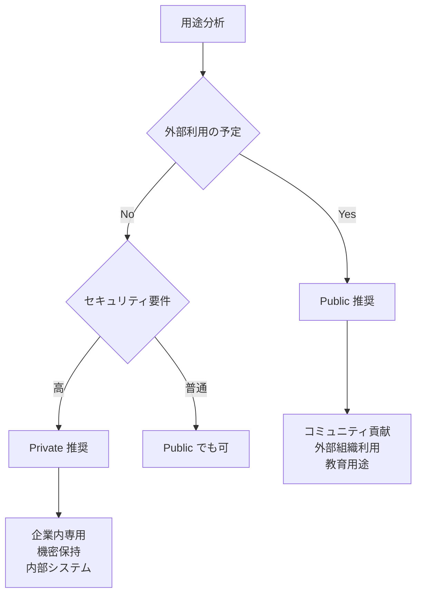

# GitHub Actions Reusable Workflow - アクセス制御について

## リポジトリの可視性とアクセス制御

### Public Repository
```yaml
# ✅ どこからでも呼び出し可能
uses: shimajima-eiji/github-actions-notifications/.github/workflows/notify.yml@main
```

**利点**:
- 任意のリポジトリから呼び出し可能
- オープンソースプロジェクトで利用可能
- コミュニティでの再利用が容易

**欠点**:
- 内部ロジックが公開される
- 悪用される可能性（ただし Secrets は保護される）

### Private Repository  
```yaml
# ✅ 同じオーナーからは呼び出し可能
# shimajima-eiji/* からの呼び出し → OK

# ❌ 異なるオーナーからは呼び出し不可
# other-user/* からの呼び出し → ERROR
# nomuraya-org/* からの呼び出し → ERROR
```

**利点**:
- ロジックが非公開
- セキュリティが向上
- 内部専用システムとして運用可能

**欠点**:
- 同じオーナーのリポジトリからのみ利用可能
- 外部との連携が困難

### Internal Repository (Enterprise のみ)
```yaml
# Enterprise 内のリポジトリからのみ呼び出し可能
```

## 現在の構成での影響

### 同じオーナー（shimajima-eiji）のリポジトリ
```bash
# これらは Private でも動作する
shimajima-eiji/.VercelV0_2_Organization
shimajima-eiji/any-personal-project
shimajima-eiji/other-repos
```

### 異なるオーナーのリポジトリ
```bash
# これらは Private だと動作しない
nomuraya-dojo/some-repo
nomuraya-hostings/another-repo
other-users/their-repo
```

## 推奨設定

### 1. Public 推奨のケース
- **オープンソースプロジェクト**として公開したい
- **コミュニティ**での再利用を促進したい
- **外部組織**（nomuraya-* など）でも利用予定
- **教育・研修用途**で事例として共有したい

### 2. Private 推奨のケース  
- **企業内専用**システムとして運用
- **セキュリティ**を重視する必要がある
- **内部ロジック**を非公開にしたい
- shimajima-eiji アカウント内でのみ利用

## テスト方法

現在 Public で動作している状態から Private に変更してテストする手順：

### Step 1: Private に変更
1. `shimajima-eiji/github-actions-notifications` → Settings
2. General → Danger Zone → "Change repository visibility"
3. "Make private" を選択

### Step 2: 動作確認
```yaml
# .VercelV0_2_Organization で動作テスト
name: Test Private Notification
on: workflow_dispatch

jobs:
  test:
    uses: shimajima-eiji/github-actions-notifications/.github/workflows/notify.yml@main
    with:
      status: "info"
      message: "Testing private repository access"
    secrets:
      SLACK_WEBHOOK_URL: ${{ secrets.SLACK_WEBHOOK_URL }}
```

### Step 3: エラー例
Private 設定で異なるオーナーから呼び出すと以下のエラー：

```
Error: Repository not found or you do not have permission to access it
```

または

```
Error: The workflow 'notify.yml' is not available in the repository 'shimajima-eiji/github-actions-notifications'
```

## 推奨方針

### 現在の用途を考慮した推奨設定



### 判断基準

1. **nomuraya-* 組織での利用予定** → Public 必須
2. **教育・研修での事例活用** → Public 推奨  
3. **オープンソース貢献** → Public 推奨
4. **企業機密保持** → Private 推奨
5. **個人専用システム** → Private で十分

## 結論

**shimajima-eiji アカウント内でのみ利用する場合は Private でも問題なく動作します**が、将来の拡張性を考慮すると **Public のままにしておくことを推奨**します。

特に研修講師として活動される場合、このシステムが教育事例や他の組織での活用につながる可能性があるためです。